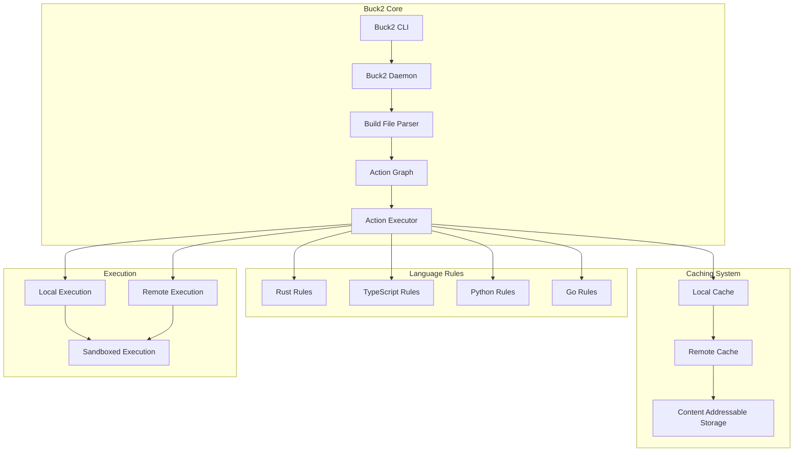
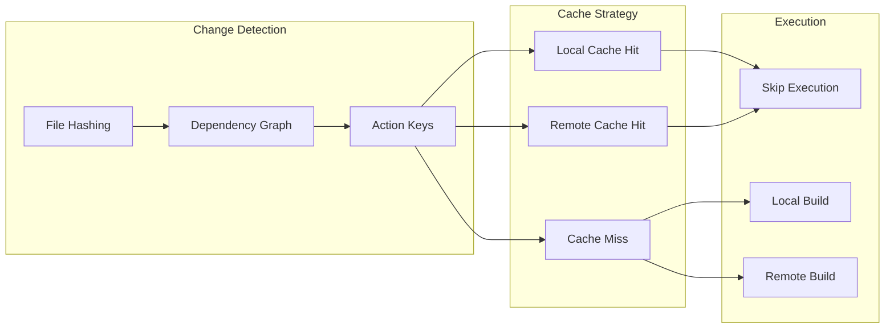
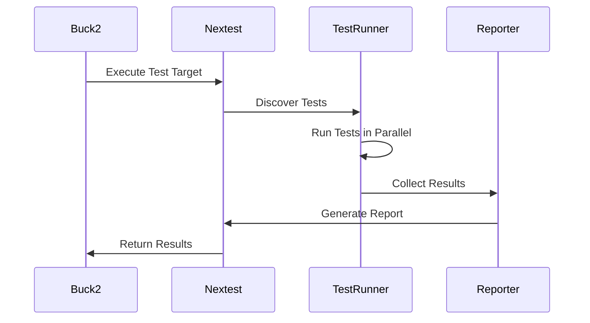

# Build System Architecture

## Overview

The monorepo uses Buck2 as the primary build system, providing fast, reliable, and hermetic builds across multiple languages and platforms. This document details the build system architecture, configuration, and best practices.

## Buck2 Architecture

### Core Components



## Configuration Structure

### Root Configuration (.buckconfig)

```ini
[buildfile]
name = BUCK

[parser]
target_platform_detector_spec = config//platforms:detector

[rust]
rustc_flags = --cap-lints=warn
edition = 2021
default_raw_headers = true

[test]
rust_test_runner = nextest
parallel_execution = true

[cache]
mode = readwrite
dir = .buck-cache

[build]
threads = 0  # Use all available cores

[log]
level = info
```

### Platform Detection

```python
# config/platforms/BUCK
load("@prelude//platforms:defs.bzl", "execution_platform", "platform")

# Execution platforms
execution_platform(
    name = "linux-x86_64",
    cpu_configuration = "config//cpu:x86_64",
    os_configuration = "config//os:linux",
)

execution_platform(
    name = "macos-arm64",
    cpu_configuration = "config//cpu:arm64", 
    os_configuration = "config//os:macos",
)

execution_platform(
    name = "windows-x86_64",
    cpu_configuration = "config//cpu:x86_64",
    os_configuration = "config//os:windows",
)

# Platform detector
platform(
    name = "detector",
    constraint_values = select({
        "config//os:linux": ["config//os:linux"],
        "config//os:macos": ["config//os:macos"],
        "config//os:windows": ["config//os:windows"],
    }) + select({
        "config//cpu:x86_64": ["config//cpu:x86_64"],
        "config//cpu:arm64": ["config//cpu:arm64"],
    }),
)
```

## Language-Specific Build Rules

### Rust Build Rules

```python
# config/build_rules/rust.bzl
def rust_library(
    name,
    srcs,
    deps = [],
    crate_features = [],
    edition = "2021",
    **kwargs
):
    """Enhanced Rust library rule with security and quality checks."""
    
    # Security scanning
    native.genrule(
        name = name + "_security_scan",
        srcs = srcs,
        cmd = "cargo audit --file $(location Cargo.toml) && touch $OUT",
        out = name + "_security.marker",
    )
    
    # Quality checks
    native.genrule(
        name = name + "_quality_check",
        srcs = srcs,
        cmd = "cargo clippy --all-targets --all-features -- -D warnings && touch $OUT",
        out = name + "_quality.marker",
    )
    
    # Main library target
    native.rust_library(
        name = name,
        srcs = srcs,
        deps = deps + [
            ":" + name + "_security_scan",
            ":" + name + "_quality_check",
        ],
        crate_features = crate_features,
        edition = edition,
        **kwargs
    )

def rust_binary(
    name,
    srcs,
    deps = [],
    **kwargs
):
    """Enhanced Rust binary rule with optimization and security."""
    
    # Release build with optimizations
    native.rust_binary(
        name = name,
        srcs = srcs,
        deps = deps,
        rustc_flags = [
            "-C", "opt-level=3",
            "-C", "lto=fat",
            "-C", "codegen-units=1",
            "-C", "panic=abort",
        ],
        **kwargs
    )
    
    # Debug build for development
    native.rust_binary(
        name = name + "_debug",
        srcs = srcs,
        deps = deps,
        rustc_flags = [
            "-C", "opt-level=0",
            "-C", "debuginfo=2",
        ],
        **kwargs
    )
```

### TypeScript Build Rules

```python
# config/build_rules/typescript.bzl
def typescript_library(
    name,
    srcs,
    deps = [],
    **kwargs
):
    """TypeScript library with Rust-based tooling."""
    
    # Format check with dprint
    native.genrule(
        name = name + "_format_check",
        srcs = srcs,
        cmd = "dprint check $(SRCS) && touch $OUT",
        out = name + "_format.marker",
    )
    
    # Type checking
    native.genrule(
        name = name + "_type_check",
        srcs = srcs + ["tsconfig.json"],
        cmd = "tsc --noEmit && touch $OUT",
        out = name + "_types.marker",
    )
    
    # Main library
    native.typescript_library(
        name = name,
        srcs = srcs,
        deps = deps + [
            ":" + name + "_format_check",
            ":" + name + "_type_check",
        ],
        **kwargs
    )
```

## Build Optimization Strategies

### Incremental Builds



### Parallel Execution

- **Target-Level Parallelism**: Independent targets build concurrently
- **Action-Level Parallelism**: Multiple actions within targets
- **Test Parallelism**: Tests run in parallel with nextest
- **Resource Management**: CPU and memory limits per action

### Caching Strategy

#### Local Caching

```bash
# Cache configuration
.buck-cache/
├── action_cache/     # Action results
├── artifact_cache/   # Build artifacts  
├── dep_files/       # Dependency files
└── metadata/        # Cache metadata
```

#### Remote Caching

```yaml
# Remote cache configuration
remote_cache:
  endpoint: "https://cache.company.com"
  authentication:
    method: "oauth2"
    token_endpoint: "https://auth.company.com/token"
  compression: "zstd"
  timeout: "30s"
```

## Cross-Language Dependencies

### Rust ↔ TypeScript

```python
# Example: Rust library with TypeScript bindings
rust_library(
    name = "core_lib",
    srcs = glob(["src/**/*.rs"]),
    crate_features = ["wasm"],
)

# Generate WASM bindings
genrule(
    name = "wasm_bindings",
    srcs = [":core_lib"],
    cmd = "wasm-pack build --target web --out-dir $OUT",
    out = "pkg",
)

typescript_library(
    name = "web_client",
    srcs = glob(["web/**/*.ts"]),
    deps = [":wasm_bindings"],
)
```

### Rust ↔ Python

```python
# Python extension from Rust
rust_library(
    name = "python_ext",
    srcs = glob(["python_ext/**/*.rs"]),
    crate_type = "cdylib",
    crate_features = ["pyo3/extension-module"],
)

python_library(
    name = "py_client",
    srcs = glob(["python/**/*.py"]),
    deps = [":python_ext"],
)
```

## Testing Integration

### Test Execution Flow



### Test Configuration

```toml
# .config/nextest.toml
[profile.default]
retries = 2
test-threads = "num-cpus"
failure-output = "immediate-final"

[profile.ci]
retries = 3
test-threads = "num-cpus"
failure-output = "final"
junit-path = "test-results.xml"

[profile.coverage]
retries = 1
test-threads = 1
```

## Performance Monitoring

### Build Metrics

```rust
// Build performance tracking
#[derive(Debug, Serialize)]
pub struct BuildMetrics {
    pub total_duration: Duration,
    pub cache_hit_rate: f64,
    pub parallel_efficiency: f64,
    pub target_count: usize,
    pub action_count: usize,
}

impl BuildMetrics {
    pub fn collect() -> Self {
        // Collect metrics from Buck2 daemon
        todo!()
    }
    
    pub fn report(&self) {
        println!("Build completed in {:?}", self.total_duration);
        println!("Cache hit rate: {:.1}%", self.cache_hit_rate * 100.0);
        println!("Parallel efficiency: {:.1}%", self.parallel_efficiency * 100.0);
    }
}
```

### Performance Optimization

#### Build Time Analysis

```bash
# Analyze build performance
buck2 log what-ran --format=json | \
  jq '.[] | select(.duration > 10) | {target: .target, duration: .duration}' | \
  sort -k2 -nr
```

#### Cache Effectiveness

```bash
# Cache hit rate analysis
buck2 log cache-hit-rate --last-build
```

## Troubleshooting

### Common Issues

#### Build Failures

```bash
# Clean build cache
buck2 clean

# Verbose build output
buck2 build //... --verbose 2

# Debug specific target
buck2 build //path/to:target --show-output
```

#### Cache Issues

```bash
# Verify cache integrity
buck2 cache verify

# Reset local cache
rm -rf .buck-cache
buck2 clean
```

#### Performance Issues

```bash
# Profile build performance
buck2 build //... --profile

# Analyze critical path
buck2 log critical-path --last-build
```

### Debugging Tools

#### Build Graph Visualization

```bash
# Generate dependency graph
buck2 query "deps(//...)" --output-format=dot > deps.dot
dot -Tpng deps.dot -o deps.png
```

#### Action Inspection

```bash
# Inspect action details
buck2 log what-ran --format=json | jq '.[] | select(.target == "//path/to:target")'
```

## Best Practices

### Build File Organization

1. **Modular Structure**: Separate build files by component
2. **Consistent Naming**: Follow naming conventions
3. **Documentation**: Comment complex build rules
4. **Validation**: Use build file linting

### Performance Guidelines

1. **Minimize Dependencies**: Only include necessary dependencies
2. **Optimize Caching**: Structure for maximum cache reuse
3. **Parallel-Friendly**: Design for concurrent execution
4. **Resource Awareness**: Consider memory and CPU usage

### Security Considerations

1. **Hermetic Builds**: Ensure reproducible builds
2. **Dependency Scanning**: Regular security audits
3. **Sandboxing**: Isolate build actions
4. **Access Control**: Restrict build system access