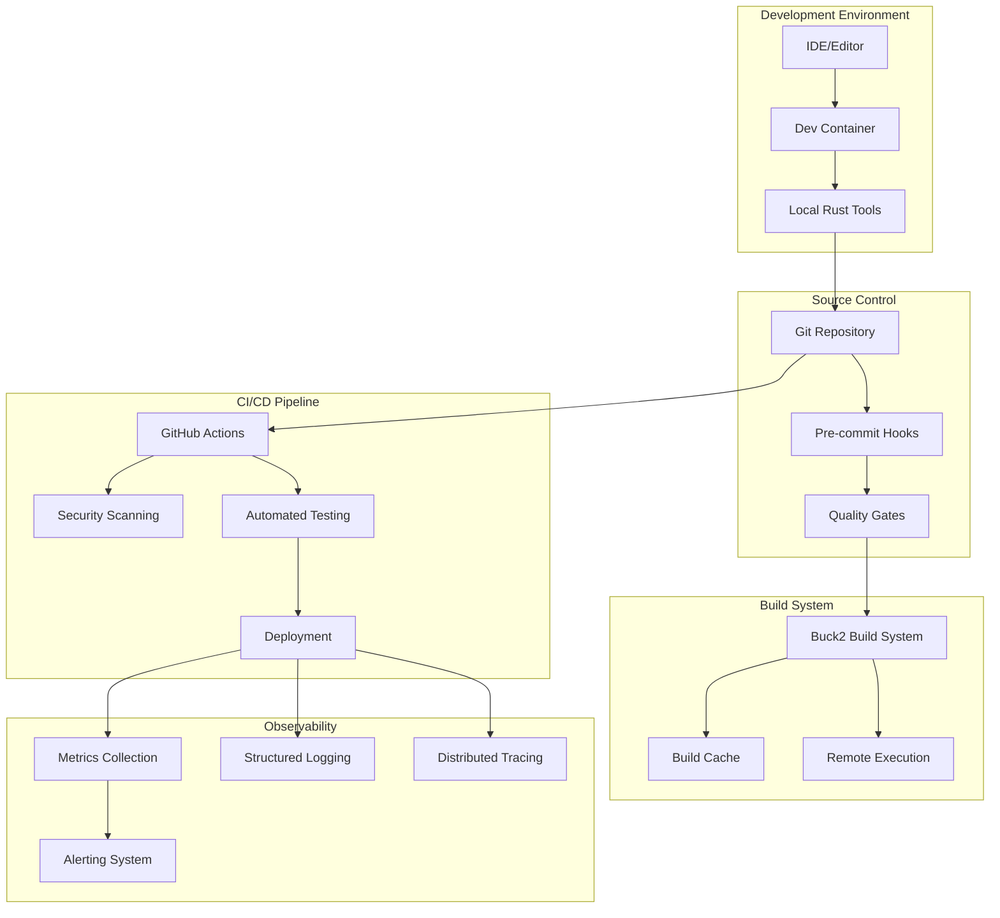
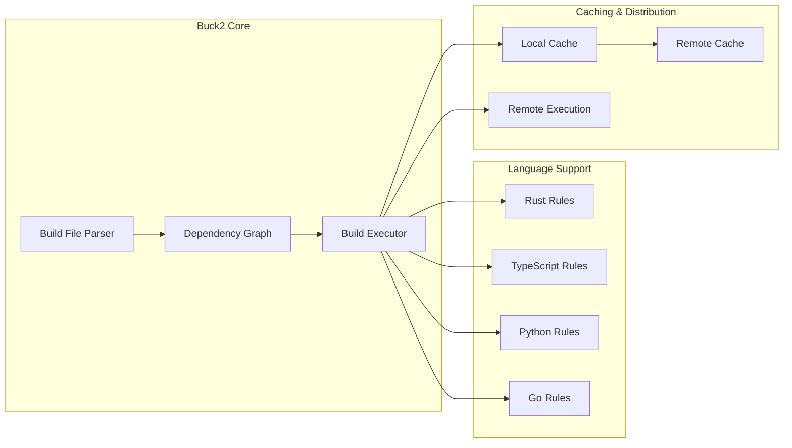
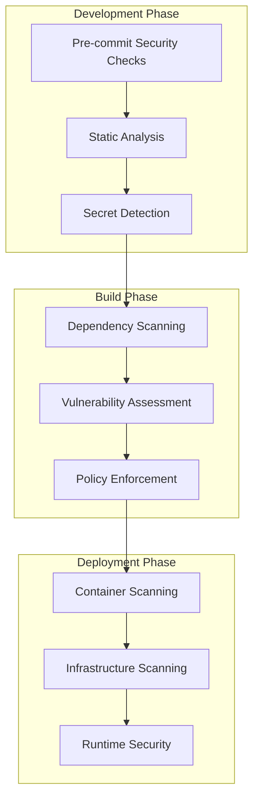
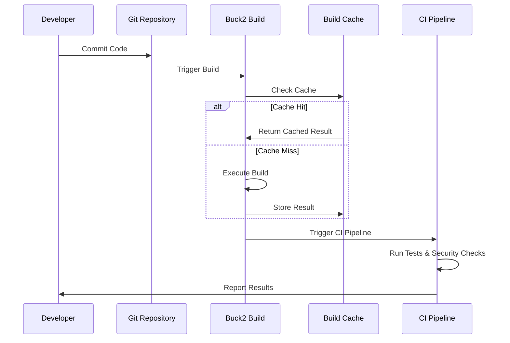
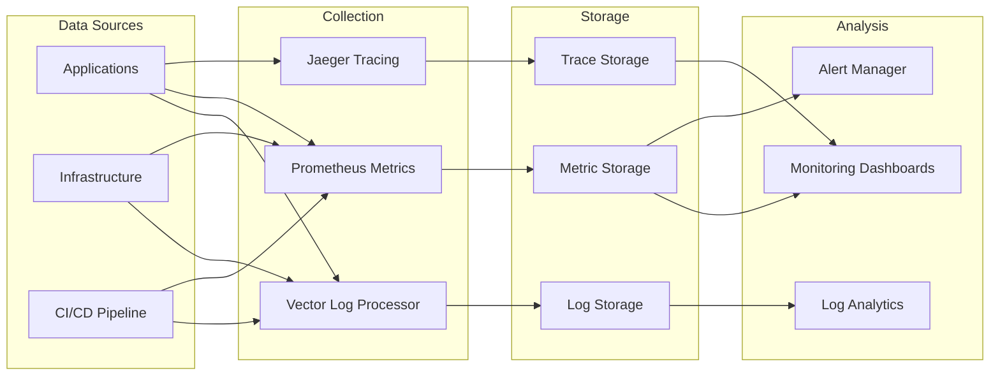
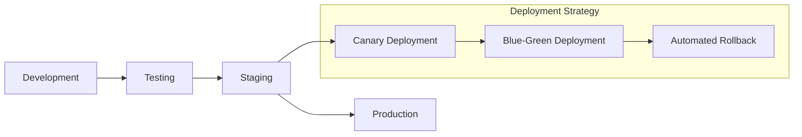

# System Architecture

## Overview

The monorepo template implements a scalable, secure, and observable architecture designed for large-scale software development. The system follows patterns established by companies like Google and Meta, with Buck2 as the build system and Rust-based tooling throughout.

## High-Level Architecture



## Component Architecture

### Repository Structure

The monorepo follows a structured layout optimized for large-scale development:

```
monorepo/
├── apps/           # Application services
├── libs/           # Shared libraries  
├── tools/          # Development tools
├── infra/          # Infrastructure code
├── docs/           # Documentation
├── scripts/        # Automation scripts
├── config/         # Configuration files
└── examples/       # Example implementations
```

### Build System Components



## Security Architecture

### Defense in Depth



## Data Flow Architecture

### Build Data Flow



### Observability Data Flow



## Scalability Considerations

### Horizontal Scaling

- **Build System**: Buck2 supports distributed builds and remote execution
- **CI/CD**: Parallel pipeline execution with matrix builds
- **Observability**: Distributed collection and processing
- **Development**: Multiple teams working independently

### Performance Optimizations

- **Incremental Builds**: Only rebuild changed components
- **Build Caching**: Aggressive caching at multiple levels
- **Parallel Execution**: Concurrent build and test execution
- **Resource Management**: Efficient resource utilization

## Technology Stack

### Core Technologies

| Component | Technology | Rationale |
|-----------|------------|-----------|
| Build System | Buck2 | Fast, scalable, hermetic builds |
| Language | Rust | Performance, safety, ecosystem |
| CI/CD | GitHub Actions | Integration, flexibility |
| Containerization | Docker | Standardization, portability |
| Orchestration | Kubernetes | Scalability, reliability |

### Rust-Based Tooling

| Purpose | Tool | Alternative Replaced |
|---------|------|---------------------|
| Text Search | ripgrep | grep |
| File Finding | fd | find |
| Code Formatting | rustfmt + dprint | prettier, black |
| Linting | clippy | eslint, pylint |
| Security Scanning | cargo-audit | npm audit |
| Benchmarking | hyperfine | time |
| Log Processing | Vector | logstash |

## Integration Points

### External Systems

- **Version Control**: Git with GitHub
- **Container Registry**: Docker Hub / GitHub Container Registry
- **Cloud Provider**: AWS/GCP/Azure (configurable)
- **Monitoring**: Prometheus + Grafana
- **Alerting**: AlertManager + PagerDuty

### Internal Integrations

- **IDE Integration**: VS Code extensions and configurations
- **Development Environment**: Consistent dev containers
- **Quality Gates**: Automated enforcement at multiple stages
- **Documentation**: Automated generation and maintenance

## Deployment Architecture

### Environment Progression



### Infrastructure as Code

- **Terraform**: Infrastructure provisioning
- **Kubernetes Manifests**: Application deployment
- **Helm Charts**: Package management
- **GitOps**: Declarative configuration management

## Disaster Recovery

### Backup Strategy

- **Source Code**: Git with multiple remotes
- **Build Artifacts**: Multi-region storage
- **Configuration**: Version-controlled infrastructure
- **Data**: Regular backups with point-in-time recovery

### Recovery Procedures

- **RTO**: Recovery Time Objective < 4 hours
- **RPO**: Recovery Point Objective < 1 hour
- **Automated Failover**: Critical services
- **Manual Procedures**: Documented runbooks